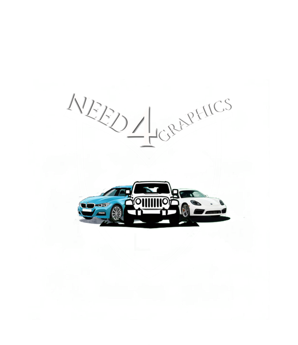

<h1 align="center">Need For Graphics</h1>

<p align="center">
    
</p>

A Three.js-based 3D game for studying friction forces in physical systems.

## Overview

This game simulates friction forces using Three.js and Cannon-es physics engine. It features 3 custom cars, 15 custom objects, and 5 different surfaces with varying friction properties. Users can interact with the simulation in real-time, experiment with different parameters, and visualize physical forces at work. The game includes 4 swappable shaders that completely transform the visual appearance of the environment while running. Designed to be both educational and entertaining, it provides an interactive platform for exploring friction physics through practical experimentation.

## Features

- Real-time 3D simulation of static and kinetic friction
- Physics-based interactions using Cannon-es physics engine
- 5 different surfaces with varying friction coefficients
- Interactive controls for adjusting simulation parameters
- 4 shaders that changes all of the appereance of the world and the cars
- 3 custom cars with unique properties and 15 custom objects that can be added anywhere in the world
- Real-time visualization of forces, velocities, and accelerations

## Installation

```bash
git clone https://github.com/tanercelikkiran/friction-forces.git
```

After cloning the repository, open the project in a code editor (**WebStorm** is recommended) and run the following commands in the terminal:

```bash
npm install
```

## Usage

You can start the game by just opening `index.html` in your browser.

WARNING:

## Important Notes

- **Browser Compatibility**: Use **Google Chrome** for optimal experience. Firefox is not recommended due to performance and compatibility issues.
- **Performance**: The simulation may run slowly on older devices or low-end hardware.
- **Loading Time**: Allow sufficient time for all models to load completely before interacting.
- **Sandbox Mode**: Always add several objects when in sandbox mode to prevent errors or unexpected behavior.
- **Troubleshooting**:
  - If experiencing inconsistent startup behavior, close and reopen the project from the code editor
  - For persistent issues, try closing and restarting Chrome
  - Ensure you wait for complete loading of all assets before interaction

## Project Structure

The project uses:

- Three.js (v0.170.0) for 3D rendering
- Cannon-es (v0.20.0) for physics simulation
- Vite for development and building

## Requirements

- Node.js and npm
- Modern web browser (**Google Chrome** recommended) with WebGL support

## Contributors

- Taner Çelikkıran (@tanercelikkiran)
- Barış Kılıç (@KBarisK)
- Kerem Efe Aydoğdu (@b2200356066)
- Zeynep Nisa Karataş (@znisakaratas)
- Sena Ergün (@senaergun)

## License

This project is licensed under the GNU General Public License v2.0 - see the [LICENSE](LICENSE) file for details.
